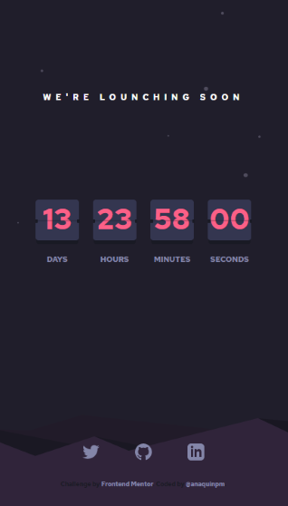
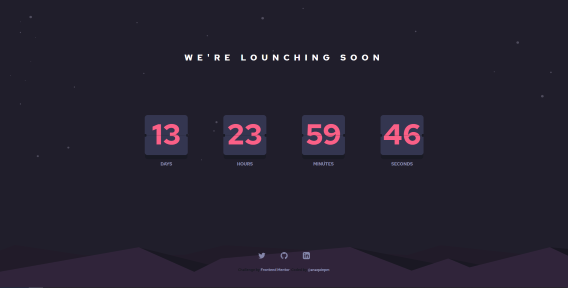

# Frontend Mentor - Launch countdown timer solution

This is a solution to the [Launch countdown timer challenge on Frontend Mentor](https://www.frontendmentor.io/challenges/launch-countdown-timer-N0XkGfyz-). Frontend Mentor challenges help you improve your coding skills by building realistic projects. 

## Table of contents

- [Frontend Mentor - Launch countdown timer solution](#frontend-mentor---launch-countdown-timer-solution)
  - [Table of contents](#table-of-contents)
  - [Overview](#overview)
    - [The challenge](#the-challenge)
    - [Screenshots](#screenshots)
      - [Mobile](#mobile)
      - [Desktop Screen](#desktop-screen)
    - [Links](#links)
    - [Built with](#built-with)
  - [NPM Commands](#npm-commands)
  - [Set Countdown](#set-countdown)
  - [Author](#author)

## Overview

Countdown timer made in JS and SCSS

### The challenge

Users should be able to:

- See hover states for all interactive elements on the page
- See a live countdown timer that ticks down every second (start the count at 14 days)

### Screenshots

#### Mobile


#### Desktop Screen



### Links

- Live Site URL on netlify: [https://countdown-anaquinpm.netlify.app/](https://countdown-anaquinpm.netlify.app/)

### Built with

- Semantic HTML5 markup
- SCSS
  - CSS Grid
  - Flexbox
- JavaScript
- Web Responsive Design

## NPM Commands

```bash
# Dependency Installation
$ npm install

# Development environment
$ npm run dev   // folder: src

# Web for production
$ npm run build   // folder: ./
```


## Set Countdown

```javascript
// ./src/index.js
// change/delete the _AMOUNT_ parameters
const eventDay = new Date();
eventDay.setTime(eventDay.getTime() + dayMill * _AMOUNT_ + hourMill * _AMOUNT_ + minMill * _AMOUNT_+ secMill * _AMOUNT_ );

```

## Author

- [LinkedIn](https://www.linkedin.com/in/pablo-mart%C3%ADn-anaqu%C3%ADn-24b28825/)
- Twitter - [@anaquinpm](https://www.twitter.com/anaquinpm)
